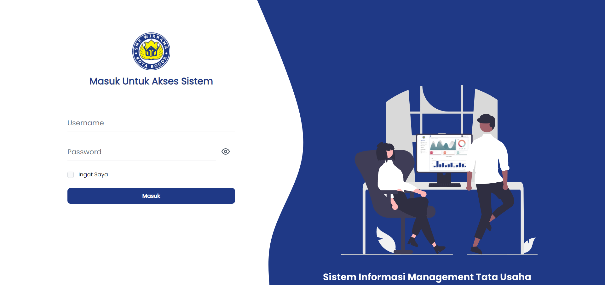
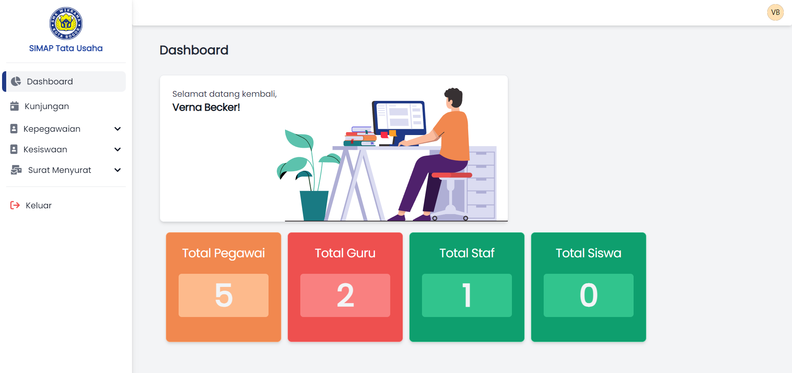

# Sistem Data Siswa dan kepegawaian | Laravel + Bostraps

Sistem Data Siswa dan pegeawaian Merupkana sistem yang mengelola data terkait surat menyurat yang meliputi data pegawai,data siswa dan surat masuk dan surat keluar

## Fitur

- Dashboard
- Data Pegawai
- Data Siswa
- Surat Masuk & surat keluar
- Export & Import
- Profile

## Teknologi

**Fornt-End:** HTML, CSS, JavaScript, Bootstrap 

**Framework:** PHP, Laravel 

**Back-End:** MySql

## AKSES REPOSITORY

## Screenshots

**HALAMAN HALAMAN LOGIN** 

**HALAMAN HALAMAN DASHBOARD** 

## Feedback

Berikan feedback atau Ingin Memproleh SourceCode:

**EMAIL DEVELOPER :** 

mikozua45@gmail.com

